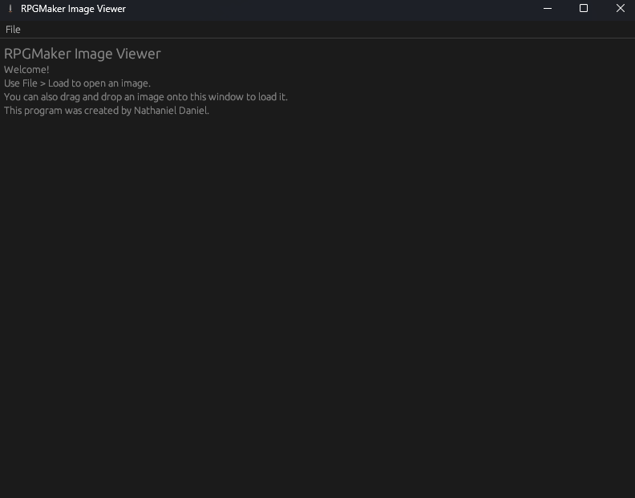
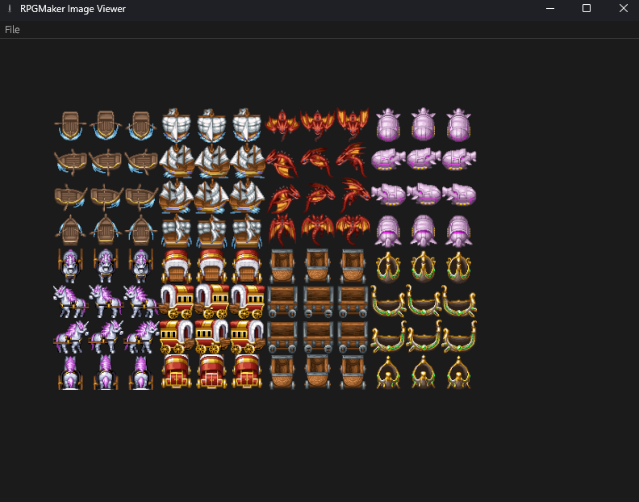

# rpgmv-image-viewer
A graphical application to view encrypted RPGMaker images.
Contrary to its name, it also supports RPGMaker MZ images since they are the same format.
This program supports being used as the default program to open ".rpgmvp" and ".png_" files on Windows.

## Previews

## Installation
You may download this program [here](https://github.com/nathaniel-daniel/rpgmv-tool/releases/download/nightly/rpgmv-image-viewer.exe).
After that, you can simply run it.

## License
Licensed under either of
 * Apache License, Version 2.0 (LICENSE-APACHE or http://www.apache.org/licenses/LICENSE-2.0)
 * MIT license (LICENSE-MIT or http://opensource.org/licenses/MIT)
at your option.

## Contributing
Unless you explicitly state otherwise, 
any contribution intentionally submitted for inclusion in the work by you, 
as defined in the Apache-2.0 license, 
shall be dual licensed as above, 
without any additional terms or conditions.